# Incident Report — CLD-0001
## Executive Account Takeover via Password Spray Cloudora

| Field | Detail |
|---|---|
| **Ticket** | CLD-0001 |
| **Client** | Cloudora (B2B HR Software, ~150 employees, London) |
| **Severity** | P1 — Executive account, active enterprise deal at risk |
| **Analyst** | SOC Analyst (reporting to Sarvesh, vCISO) |
| **Framework** | NIST SP 800-61 Rev. 2 — Computer Security Incident Handling Guide |
| **Report status** | Final |

---

## Executive Summary

On the morning of 10 August 2026, Cloudora's IT admin flagged an anomalous sign-in to CEO Daniel Reeve's account from Lagos, Nigeria at 03:12 UTC, while Reeve was known to be in London. Investigation confirmed this was **not travel but a genuine account takeover**, the result of a three day password spray campaign against 26 Cloudora employee accounts from a shared block of Nigerian IP addresses. Two accounts were successfully breached  **Daniel Reeve (CEO)** and **Priya Nair**  while the remaining 24 targeted accounts resisted compromise. On Reeve's account, the attacker established persistence by registering a rogue MFA device and creating a concealed inbox rule designed to hide finance/invoice-related correspondence, consistent with staging for Business Email Compromise (BEC) / invoice fraud. No equivalent persistence was found on Nair's account. All findings below are supported by Entra ID sign-in and audit log evidence queried via KQL.

---

## 1. Preparation

*(NIST Phase 1 context on tooling and data available at time of investigation, not a description of pre-incident controls, which were found to be insufficient see Section 5.)*

- **Data sources used:** `CloudoraSignIn_CL` (Entra ID sign-in logs, 8-day window, ~1,479 rows), `CloudoraAudit_CL` (directory/mailbox audit events)
- **Tooling:** KQL queries executed via Azure Data Explorer (functionally identical to Microsoft Sentinel Log Analytics for this purpose)
- **Gap identified:** No existing alert fired on the password-spray pattern itself (failures across many distinct accounts from one IP in a short window) or on the two high-risk post-compromise actions (new MFA device registration, new inbox rule creation). Detection depended on manual noticing of a single impossible-travel sign-in by IT — see Recommendation 4 in Section 6.

---

## 2. Detection & Analysis

### 2.1 Initial Alert
IT admin flagged a sign-in to `daniel.reeve@cloudora.io` from Lagos, Nigeria at 03:12 UTC on 10 August 2026, inconsistent with the CEO's known location (London).

### 2.2 Timeline of Events (all times UTC)

| Date/Time | Event | Source IP | Location |
|---|---|---|---|
| 08/08, 00:33–04:31 | First wave of password-spray failures across multiple accounts | 102.89.44.17, .23, 102.89.45.101 | Lagos, Nigeria |
| 09/08, 02:22–04:50 | Second wave of spray failures, continued targeting | 102.89.44.17, .23, 102.89.45.101 | Lagos, Nigeria |
| 10/08, 00:35–03:10 | Third wave of spray failures against daniel.reeve; 3 failed attempts immediately preceding breach | 102.89.44.17 | Lagos, Nigeria |
| **10/08, 03:12:05** | **Successful login — daniel.reeve@cloudora.io (Microsoft 365)** | 102.89.44.17 | Lagos, Nigeria |
| 10/08, 03:14:30 | Attacker accesses Outlook Web | 102.89.44.17 | Lagos, Nigeria |
| 10/08, 03:18:44 | **Persistence:** rogue authenticator device registered ("Pixel 6") | 102.89.44.17 | Lagos, Nigeria |
| 10/08, 03:26:02 | Attacker accesses Azure Portal | 102.89.44.17 | Lagos, Nigeria |
| 10/08, 03:31:09 | **Persistence:** inbox rule "RSS Subscriptions" created — hides mail from finance@cloudora.io or containing "invoice" | 102.89.44.17 | Lagos, Nigeria |
| 10/08, 03:44:55 | Failed login attempt — priya.nair@cloudora.io | 102.89.45.101 | Lagos, Nigeria |
| **10/08, 03:47:18** | **Successful login — priya.nair@cloudora.io (Microsoft 365)** | 102.89.45.101 | Lagos, Nigeria |
| 10/08, 03:52:40 | Attacker accesses SharePoint Online via Nair's account | 102.89.45.101 | Lagos, Nigeria |
| 10/08, 08:41:00 | Daniel Reeve's legitimate morning login | 203.0.113.11 | London, UK |
| 10/08, 08:55 | IT admin flags anomaly; investigation opens | — | — |

### 2.3 Root Cause: Password Spray (Confirmed)

Query of all `ResultType == "50126"` (invalid credential) events against the three source IPs returned **114 failed attempts across 26 distinct Cloudora accounts** over three consecutive nights (08–10 Aug), with 1–5 failures per account a distribution consistent with **password spraying** (low attempts per account, broad account coverage, designed to evade lockout thresholds) rather than brute force or credential stuffing against a single target.

Daily attempt volume: 44 (08/08) → 36 (09/08) → 34 (10/08) failures, followed by 5 successful authentications on 10/08 from the same subnet 3 against Daniel Reeve's account, 2 against Priya Nair's.

### 2.4 False-Positive Ruled Out

A separate anomaly was reviewed and excluded from scope: `omar.farah@cloudora.io` also showed unfamiliar-country sign-ins (Dubai, UAE) during the same window. Unlike the Lagos activity, Omar's Dubai sign-ins were **daytime, successful on first attempt, from his normal device, and sustained consistently across three days** a pattern consistent with legitimate business travel, not compromise. Omar's account was, however, confirmed as a **spray target** (failed attempts from the same three Lagos IPs), though none succeeded.

### 2.5 Persistence Analysis (MITRE ATT&CK)

| Technique | ID | Evidence |
|---|---|---|
| Password Spraying | T1110.003 | 114 low-frequency failed logins across 26 accounts from 3 IPs over 3 nights |
| Valid Accounts | T1078 | Successful authentication using legitimate credentials for 2 accounts |
| Device Registration (MFA persistence) | T1098.005 | Rogue "Pixel 6" authenticator registered on daniel.reeve's account at 03:18:44 |
| Email Hiding Rules | T1564.008 | "RSS Subscriptions" inbox rule created at 03:31:09, filtering finance/invoice mail out of view staging for BEC/invoice fraud |

**Note:** Persistence mechanisms (rogue MFA device, inbox rule) were found **only on Daniel Reeve's account**. Priya Nair's audit log returned no matching events her compromise window appears limited to authentication and read access (Microsoft 365, SharePoint Online), with no confirmed attacker-created backdoor.

### 2.6 Scope

- **26 accounts targeted** by the spray campaign (source IPs: 102.89.44.17, 102.89.44.23, 102.89.45.101 — Lagos, Nigeria)
- **2 accounts successfully compromised:** daniel.reeve@cloudora.io, priya.nair@cloudora.io
- **24 accounts targeted but not breached** (full list retained in query output; sample includes amelia.frost, dina.said, leah.stone, joel.kerr, isla.grant, mira.shah, jude.ross, seth.lane, ruth.dean, nina.cole, emma.hayes, freya.lynn, aria.reid, rhys.owen, ethan.wells, and others)
- **1 account reviewed and excluded as false positive:** omar.farah@cloudora.io (legitimate travel)

---

## 3. Containment, Eradication & Recovery

### 3.1 Containment (immediate)

For both compromised accounts (daniel.reeve, priya.nair):
1. **Revoke all active sessions and refresh tokens** performed before password reset, to ensure any live attacker session is terminated rather than surviving a credential change.
2. **Force password reset** at next sign-in for both accounts.
3. **Block source IPs** (102.89.44.17, 102.89.44.23, 102.89.45.101) via Conditional Access.

### 3.2 Eradication

4. **Remove the attacker's registered MFA device** ("Pixel 6") from daniel.reeve@cloudora.io performed *before* considering the account clean, since a password reset alone does not remove an attacker-controlled MFA method.
5. **Delete the malicious inbox rule** ("RSS Subscriptions") from daniel.reeve@cloudora.io.
6. **Manual verification of priya.nair's mailbox** for rules or forwarding not captured in the audit log, despite the log returning no automated findings.

### 3.3 Recovery

7. **Force password resets for all 24 non-breached targeted accounts.** Rationale: a failed login attempt confirms the password *guessed* was wrong it does not confirm the account's actual password is not otherwise compromised (e.g., sourced from a separate credential leak) or that a later attempt from unlogged infrastructure did not succeed. Resetting closes this exposure regardless of unconfirmed risk and is standard practice for any account confirmed to be on an active attacker's target list.
8. **Re-run Steps in Section 2** (timeline and scope queries) post-remediation to verify no further attacker activity from the blocked infrastructure or residual persistence.
9. **Direct, out-of-band notification** to all 26 targeted users (phone/in-person, not email, in case of residual mailbox compromise) advising them they were targeted and to expect follow-up phishing attempts.

---

## 4. Post-Incident Activity

### 4.1 Lessons Learned
- Detection relied on a human noticing a single anomalous login rather than automated correlation of the spray pattern itself, despite the pattern (many accounts, few attempts each, from a shared IP block) being a well-known, detectable signature.
- Persistence mechanisms (MFA device registration, inbox rule creation) were not alerted on in real time, allowing roughly 13 minutes and 5 minutes respectively between initial breach and entrenchment a narrow but real window in which faster detection could have prevented persistence entirely.
- Investigation depended on having both sign-in and audit logs available; the persistence findings would not have surfaced from sign-in logs alone.

### 4.2 Recommendations

| # | Recommendation | Priority |
|---|---|---|
| 1 | Enforce phishing-resistant MFA (FIDO2 / number-matching) org-wide | High |
| 2 | Deploy Conditional Access policies for impossible-travel and unfamiliar-country sign-in blocking/challenge | High |
| 3 | Alert automatically on new MFA device registrations and new inbox rule creation | High |
| 4 | Build detection rule: count of distinct accounts with failed logins per source IP within a 6-hour window, alert above threshold (see Section 4.3) | High |
| 5 | Disable legacy authentication protocols (IMAP/POP/SMTP basic auth) if still enabled | Medium |
| 6 | Targeted phishing awareness refresh for all 26 identified target list users | Medium |
| 7 | Formalize out of band communication procedure for account-compromise notifications | Medium |

### 4.3 Proposed Detection Rule (Stretch Goal)

```kql
CloudoraSignIn_CL
| where ResultType == "50126"
| where TimeGenerated > ago(6h)
| summarize FailedAttempts = count(), TargetedAccounts = dcount(UserPrincipalName) by IPAddress, bin(TimeGenerated, 6h)
| where TargetedAccounts >= 5
| order by TargetedAccounts desc
```
This would have alerted on the night of 08 August — the first night of the campaign — rather than two days later when the breach actually occurred.

---

## Appendix A — Evidence (Screenshots)

*Insert supporting KQL query screenshots below. Suggested filenames if storing images in a repo `evidence/` folder — rename to match your actual files.*

**Figure 1 — Daniel Reeve sign-in timeline, incident day (10/08)**
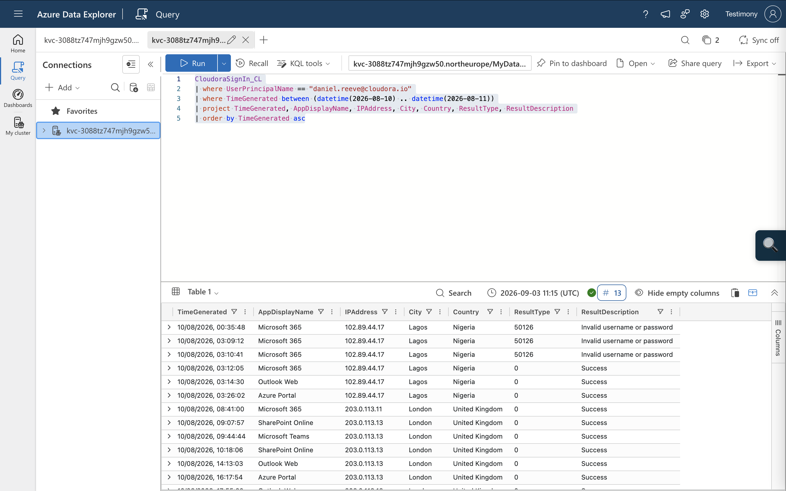

**Figure 2 — Daniel Reeve baseline sign-in locations (8-day window)**
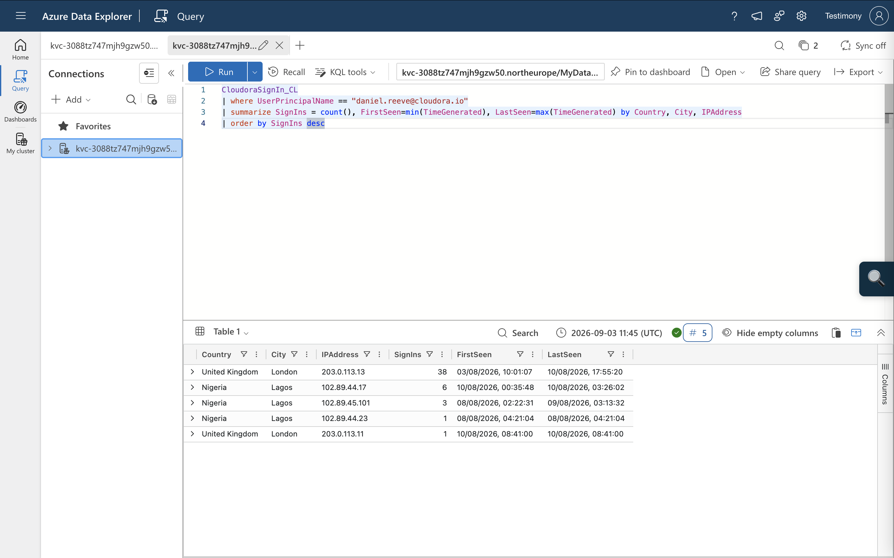

**Figure 3 — Omar Farah baseline (false-positive comparison)**
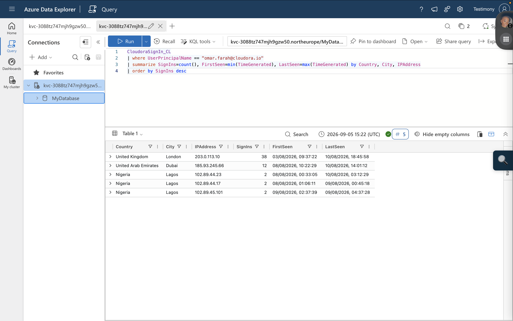

**Figure 4 — Org-wide failed login summary by source IP**
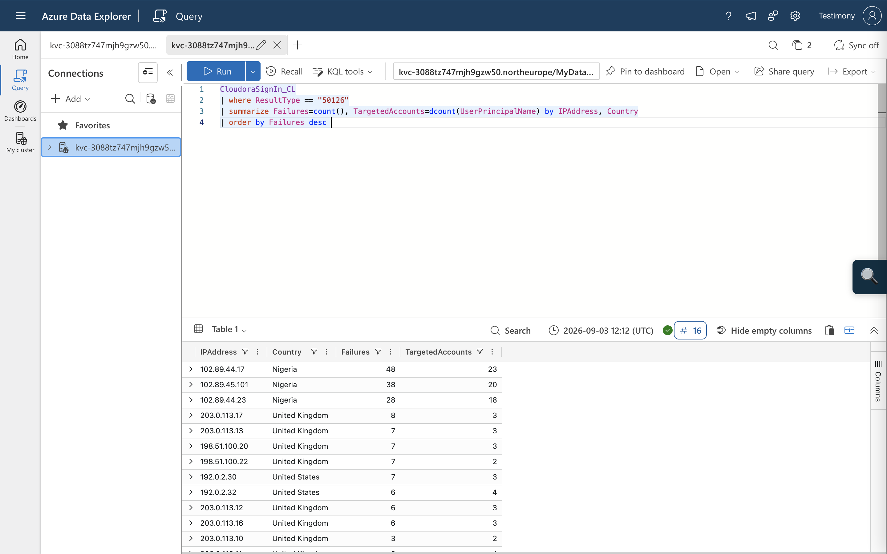

**Figure 5 — Password-spray daily attempt volume**
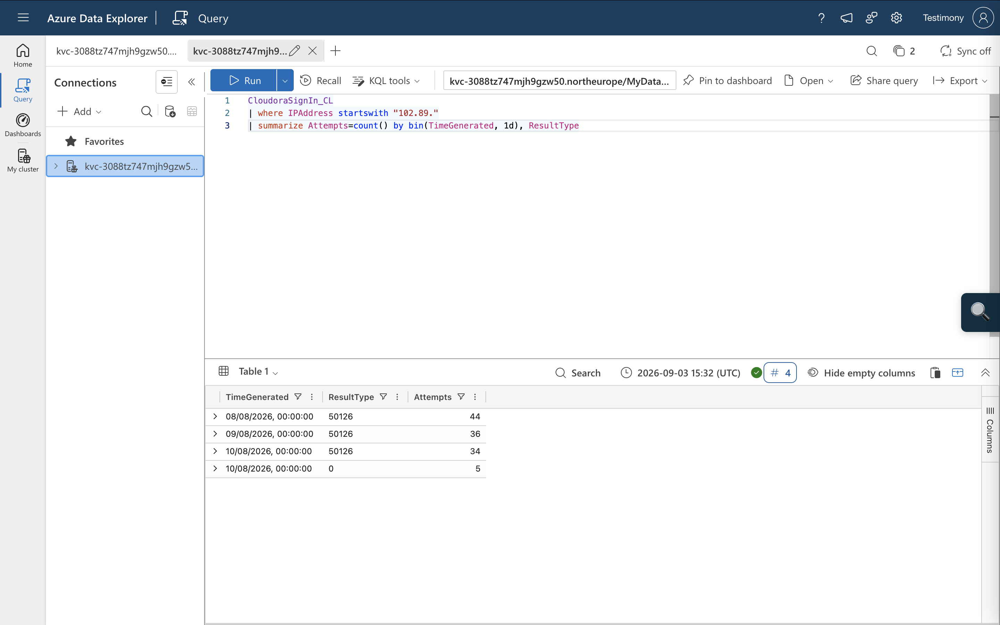

**Figure 6 — Daniel Reeve audit log: MFA device registration and inbox rule**
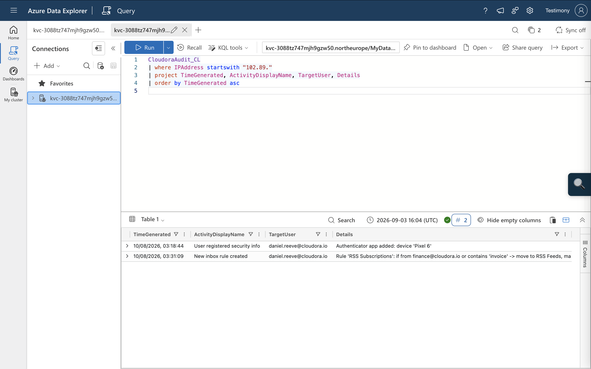

**Figure 7 — Successful attacker logins across compromised accounts**
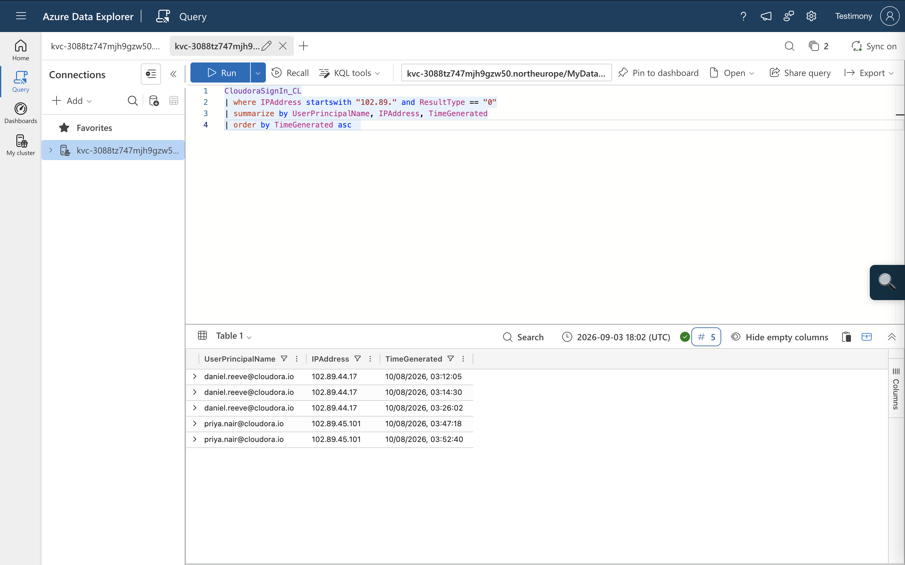

**Figure 8 — Priya Nair sign-in timeline, incident day**
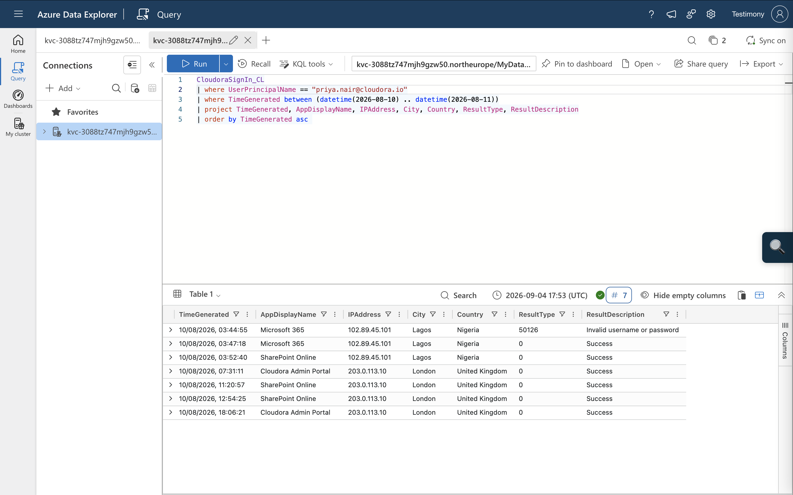

**Figure 9 — Priya Nair baseline sign-in locations**
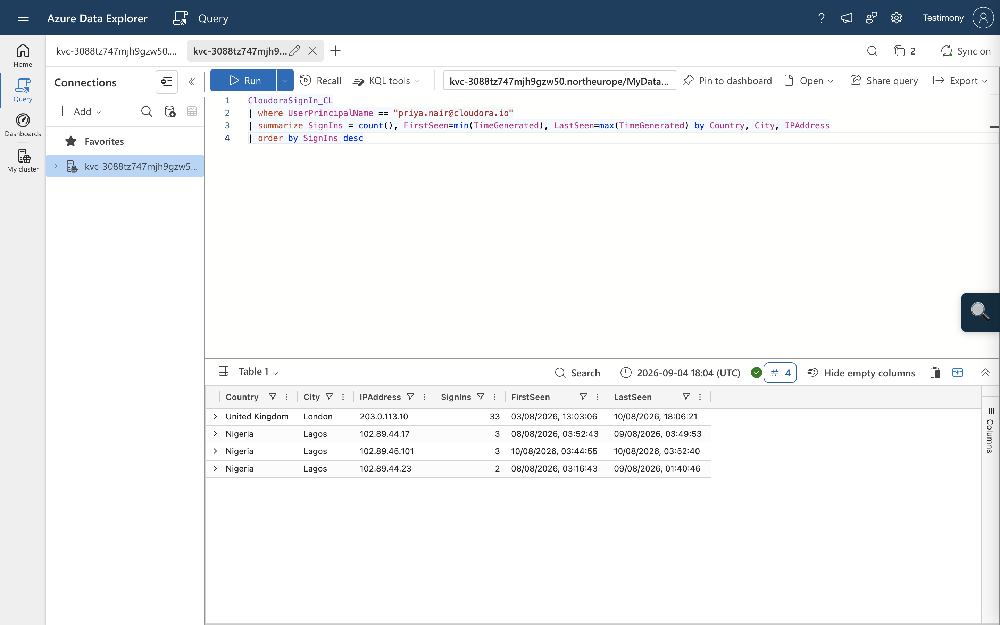

**Figure 10 — Priya Nair audit log (no persistence found)**
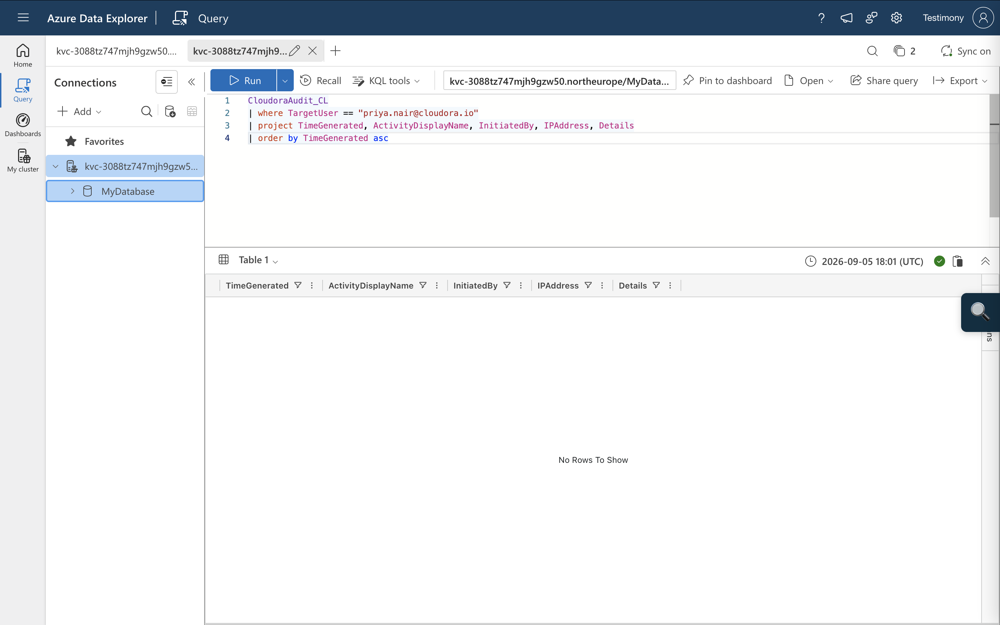

**Figure 11 — Full list of targeted accounts (spray victims)**
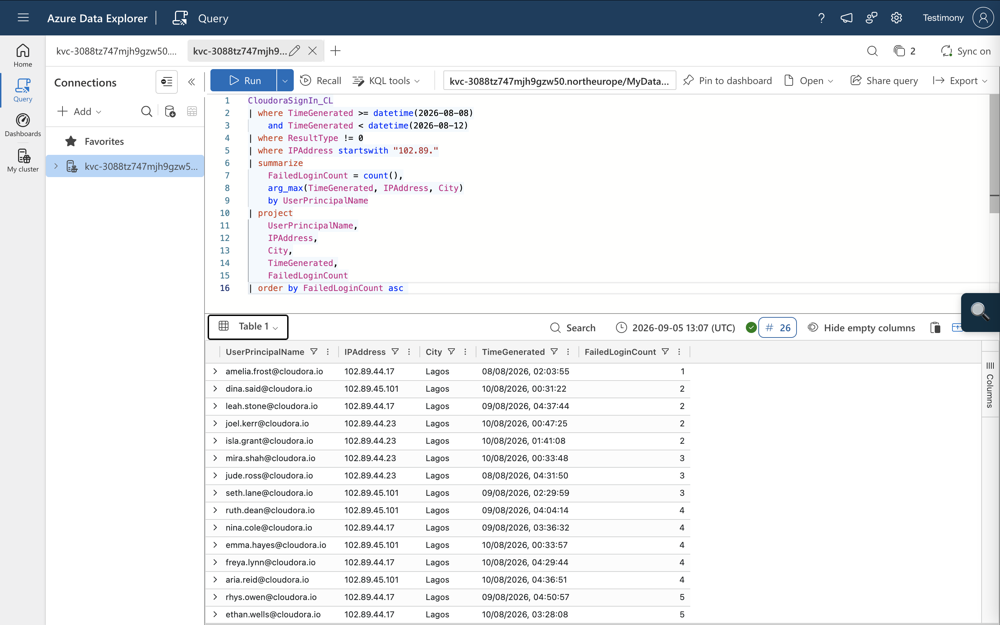

---

## Appendix B — Indicators of Compromise

| Indicator | Type | Notes |
|---|---|---|
| 102.89.44.17 | Source IP | Lagos, NG — primary spray/breach IP (Daniel Reeve) |
| 102.89.44.23 | Source IP | Lagos, NG — spray IP |
| 102.89.45.101 | Source IP | Lagos, NG — spray/breach IP (Priya Nair) |
| "Pixel 6" | Rogue MFA device | Registered on daniel.reeve@cloudora.io, 10/08 03:18:44 |
| "RSS Subscriptions" | Malicious inbox rule | Created on daniel.reeve@cloudora.io, 10/08 03:31:09 |

## Appendix C — MITRE ATT&CK Mapping

- **T1110.003** — Password Spraying
- **T1078** — Valid Accounts
- **T1098.005** — Device Registration
- **T1564.008** — Email Hiding Rules

